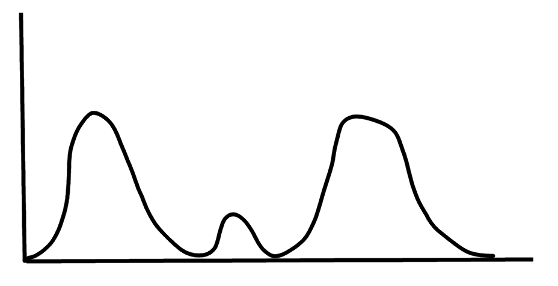
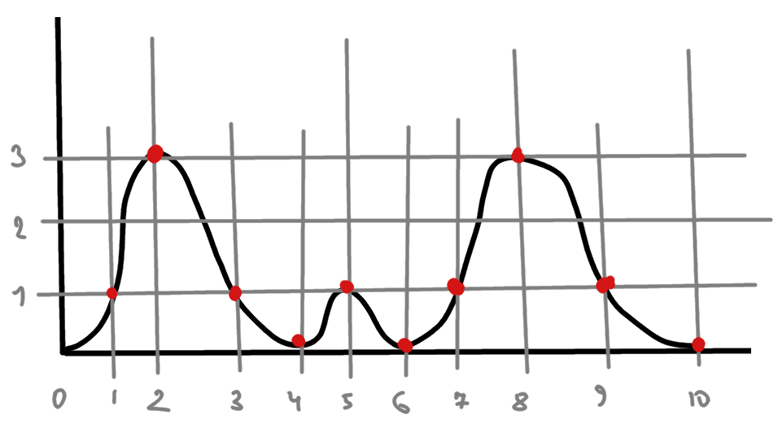
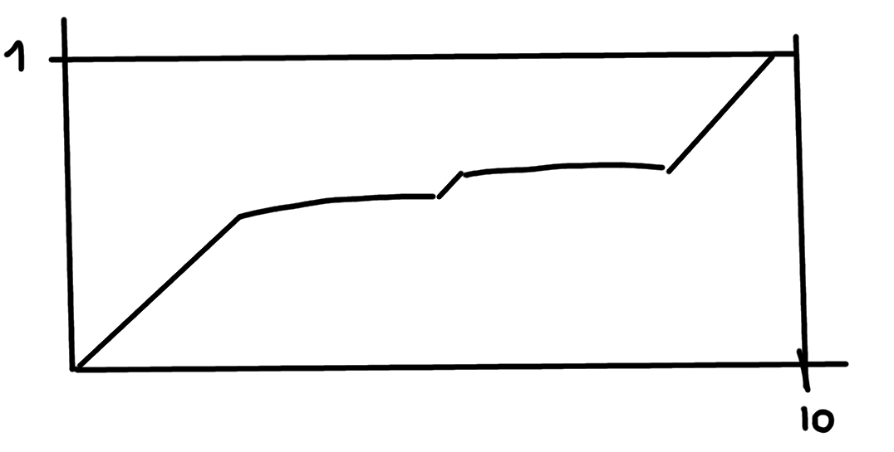

# Лекция 3

## В прошлый раз ...

Здравствуйте!

Прошлое занятие мы начали с разговора о наших ролях в процессе
изучения этого курса. Мы договорились, что я буду играть роль
представителя производства, а вы - университета.

Это логично. Вы заканчиваете бакалавриат, а мое основное место
работы - отдел аналитики и обработки данных "ИЦ Энергосервис". У нас
есть реальные задачи, а у вас - продвинутая теория, математика,
машинное обучение и все такое.

Я рассказал о наших текущих задачах, в которых требуется анализ
данных: мониторинг силовых трансформаторов, определение типов и мест
повреждений в городских распределительных сетях, анализ колебательной
устойчивости энергосистем. Эти задачи отличаются друг от друга по
масштабу. Но общим в них является то, что анализируются данные
синхронизированных векторах измерений.

Еще мы размышляли о названии курса. Его можно понимать двояко. С одной
стороны, мы можем исходить из того, что у нас есть "хорошие" данные и
на основе их анализа нам надо сказать что-то важное об объекте, к
которому относятся эти данные. Вернее, научить этому компьютер.

С другой стороны, практика такова, что в исходных данных бывает много
проблем, и вывод об объекте зачастую становится ошибочным именно из-за
проблем в данных, чему было уделено слишком мало внимания. Анализ
данных должен быть направлен в том числе и на выявление этих
проблем. Я предложил начать с этого.

В конце занятия я сделал примерно такой набросок на доске:



Я предложил представить, что это график плотности вероятности
какой-нибудь случайной величины. Например, это могло бы быть
количество одновременно наблюдаемых автомобилей на участке дороги в
течение утра, дня и вечера.

Я попросил подумать над решением такой задачи. Требуется сгенерировать
на компьютере массив случайных чисел, распределенных так, как показано
на рисунке. Каким-то похожим образом. Хорошо, если вы как-то
поделитесь с мной своими соображениями по этому поводу.

Это важная задача. Чтобы синтезировать тестовые данные, похожие на
реальные, приходится хоть сколько-то разобраться в реальном
процессе. В нашем случае реальный процесс представлен своими
статистическими характеристиками. Они могут быть даже не выявлены (мы
можем не знать формулу закона распределения и того, какие в ней есть
параметры), однако можно "накопить" такое распределение на основе
массива реальных данных.

## Основная часть

Сегодня я бы хотел дать подсказку по поводу решения этой задачи.

Прежде всего, я не предоставил вам никаких чисел, а дал только
набросок графика плотности вероятности. Давайте что-то с этим
сделаем. Мы можем добавить на рисунок координатную сетку, выбрать
несколько точек на кривой, соединить их и таким образом получить
массив значений "плотности вероятности" в большем количестве точек.



В следующем листинге на Python 3 заполняются два списка и
выводится изображение получившихся точек.

```
import matplotlib.pyplot as plt

xs = [0, 1, 2, 3, 4, 5, 6, 7, 8, 9, 10]
ys = [0, 1, 3, 1, 0, 1, 0, 1, 3, 1, 0]

plt.plot(xs, ys, "ro")
plt.grid(True)
plt.savefig("e1.png")
```

**Примечание:**. Мои примеры будут на Python 3. Для Python 3 есть
много хороших библиотек, связанных с анализом данных, организацией
данных, визуализацией и т.п.

Исходный код примеров находится в папке code рядом с этими заметками.

Как запустить пример на Windows? Допустим, вы скачали папку **code** к
себе на компьютер. После этого нужно в командной строке зайти в папку
**code** и выполнить команду:

```
> py file_name.py
```

Вместо "file_name" надо подставить реальное имя файла, содержимое
которого вы хотите выполнить.

Совсем простые места в коде я не буду комментировать. Наверно ясно,
что "plot" - это рисование графика, а "savefig" - сохранение рисунка в
файл. Но я постараюсь комментировать места, относящиеся к задаче.

Результатом выполнения программы является следующее изображение:


Теперь надо получить значения между указанными точками. Нам надо
как-то соединить эти "опорные" точки. Добавим в наш пример
интерполяцию.

Импортируем пару пакетов (это принято писать вначале текста программы):
```
import numpy as np
from scipy.interpolate import interp1d
```

numpy делает удобной работу с массивами, а из scipy.interpolate мы
берем только одну функцию для интерполяции.

Затем:

```
xs = np.array([0, 0.5, 1, 2, 3, 3.5, 4,   5, 6,   6.5, 7, 8, 9, 9.5, 10])
ys = np.array([0, 0.3, 1, 3, 1, 0.3, 0.1, 1, 0.1, 0.3, 1, 3, 1, 0.3, 0])

f = interp1d(xs, ys, kind="cubic")
xis = np.linspace(0, xs[-1], 100)
yis = f(xis)

yis = yis / (sum(yis) * 10/100)

fig = plt.figure()
plt.plot(xis, yis, "b")
plt.grid(True)
plt.savefig("e2.png")
plt.close(fig)
```

Наверно вы заметили, что я добавил точек и немного изменил некоторые
значения. Это нужно мне для того, чтобы в итоговом массиве не было
отрицательных значений. Их не должно быть у плотности
вероятности. Ниже показан результат:


В этом фрагменте кода

```
f = interp1d(xs, ys, kind="cubic")
```

по исходным данным получается функция f, в которой "спрятан" механизм
интерполяции (к слову, здесь применяется кубический сплайн).

А здесь

```
xis = np.linspace(0, xs[-1], 1000)
yis = f(xis)
```

формируется массив из 1000 чисел, равномерно (линейно) расположенных
от 0 до 10, и к ним применяется функция f. Так у нас получается больше
точек.

Здесь

```
yis = yis / (sum(yis) * 10/100)
```

я делаю так, чтобы интеграл плотности вероятности был равен
единице. Почти.

Пока мы просто "оцифровали" набросок.

А надо сгенерировать числа. Вы помните, что плотность распределения
вероятности - это производная функции распределения? Для нашей
плотности вероятности функция распределения будет выглядеть примерно
так:



Дополним наш код:

```
F = []
xfs = []
val = 0
for x, y in zip(xis, yis):
	s = y * 10/100
	val = val + s
	if val > 1:
		break
	F.append(val)
	xfs.append(x)

fig = plt.figure()
plt.plot(xfs, F, "b")
plt.grid(True)
plt.savefig("e3.png")
plt.close(fig)
```

Здесь мы получаем функцию распределения. Каждое ее новое значение мы
получаем как сумму предыдущего значения и очередного значения
плотности вероятности, умноженного на шаг интерполирования. Т.е. мы
численно интегрируем плотность вероятности.

**TODO:** Дописать про фокусы с единицей.

Результат соответствует нашим ожиданиям:


Следующая идея простая. Давайте посмотрим на функцию, обратную функции
распределения - так называемую квантильную функцию:


Чтобы получить этот рисунок, можно выполнить следующий код:

```
fig = plt.figure()
plt.plot(F, xfs, "b")
plt.grid(True)
plt.savefig("e4.png")
plt.close(fig)
```

Я просто поменял местами переменные F и xis в функции plot.

Дальше мы будем генерировать случайные числа, имеющие равномерное
распределение в диапазоне от 0 до 1, и находить значения квантильной
функции от этих чисел.

Даже рассматривая график полученной квантильной функции можно
догадаться, что, например, при одинаковой вероятности появления
каждого из таких чисел, квантильная функция даст больше значений в
интервале от 0 до 3, чем, скажем, в интервале от 3 до 6, где она
растет быстрее.

Квантильную функцию можно получить так:

```
Q = interp1d(F, xfs, kind="cubic")
```

Здесь выполняется интерполяция при "переставленных" F и xfs. F теперь
содержит значения независимой переменной в диапазоне от 0 до 1.

Для генерации случайных чисел воспользуемся библиотекой random. В
начале программы надо добавить:

```
import random
```

Сгенерируем значения:

```
vs = []
for i in range(0, 10000):
	r = random.uniform(0, 1)
	if r < 0 or r > max(F):
		continue
	vs.append(Q(r))
```

На всякий случай отбросим значения, выходящие за границы нашего
отрезка - вдруг такие будут.

Строим гистограмму:

```
fig = plt.figure()
plt.hist(vs, bins=50, density=True)
plt.plot(xis, yis, "b")
plt.grid(True)
plt.savefig("e5.png")
plt.close(fig)
```

Выводим и исходную "плотность вероятности".

Результат:


Похоже, получилось то, что надо.

**TODO:** Вывод о теории и практике.

## Домашнее задание

* Запустить все предложенные примеры, добиться их безошибочного
  выполнения.

* Сгенерировать массив значений случайной величины, плотность
  вероятности которой строго равна нулю на некотором отрезке. Другими
  словами, существует отрезок, значения из которого не встречаются
  никогда.

## Ссылки

1. [ИЦ "Энергосервис"](https://enip2.ru/)
1. [Phasor measurement
   unit](https://en.wikipedia.org/wiki/Phasor_measurement_unit)
1. Rodionov A.V., Blinov A.N., Butin K.P., Mokeev A.V., Popov
   A.I. Practical Issues of Processing Synchrophasor Measurement Data
   in the Analysis of Low-Frequency Oscillations in Power System //
   2019 2nd International Youth Scientific and Technical Conference on
   Relay Protection and Automation (RPA), Moscow, Russia, 2019,
   pp. 1-16.
1. Blinov A.N., Rodionov A.V., Goryachevskiy I.A., Mokeev A.V., Popov
   A.I. Synchrophasor measurements application formonitoring
   transformers in step-downsubstations. // 2019 2nd International
   Youth Scientific and Technical Conference on Relay Protection and
   Automation (RPA), Moscow, Russia, 2019.
1. [Probability density
   function](https://en.wikipedia.org/wiki/Probability_density_function)
1. [Interpolation
   (scipy.interpolate)](https://docs.scipy.org/doc/scipy/reference/tutorial/interpolate.html)
1. [Quantile
   function](https://en.wikipedia.org/wiki/Quantile_function)
1. [random — Generate pseudo-random
   numbers](https://docs.python.org/3/library/random.html)
