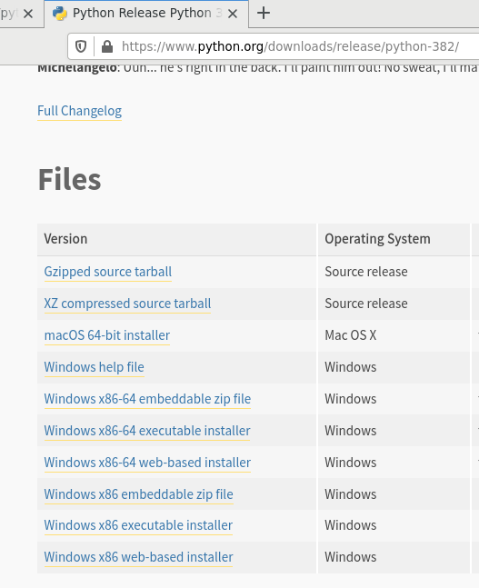
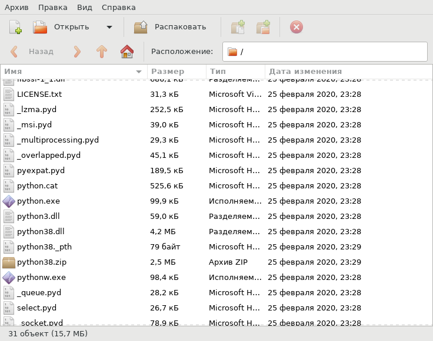

# Python 3 как инструмент анализа данных

## Введение

* Очень много материалов, нет проблем
* Не хочу писать больших предложений
* Использование в исследованиях
* Прототипирование, проблемы переписывания

## Установка Python 3

* Собственно установка

  Ubuntu

  ```
  $ sudo apt update
  $ sudo apt install python3
  ```

  Windows

  

  Варианты загрузки:

  

  Вариант для установки:

  

  Встраиваемый Python

  

  Содержимое архива:

  

  Допустим, вы распаковали архив в папку `D:lec\`.

  Создайте там файл `hello.py` со следующим содержимым:

  ```
  print('Hello, world!')
  ```

  Чтобы запустить программу, выполните команду:

  ```
  python.exe hello.py
  ```

* Онлайн

  Пример

  

## Установка пакетов

* easy_install
* pip3

  ```
  $ sudo pip3 install package_name
  ```

  Разбор.

  Обновление:

  ```
  $ sudo pip3 install -U package_name
  ```

  Установка в папку пользователя

  ```
  $ sudo pip3 install --user package_name
  ```

  Особенности именования в Windows.

* PyPI
* виртуальное окружение, virtualenv

## Jupyter notebook

* Установка
* Запуск
* Настройка

  ```
  $ cd jupyter
  $ jupyter notebook
  ```

  В браузере должна открыться вкладка:

  

  Пример страницы:

  

* Совместная работа

* Я его не люблю, но иногда использую

## Пакеты

### Визуализация данных

* matplotlib

  Установка:

  ```
  $ pip3 install matplotlib
  ```

  Примеры есть в лекции об аномалиях в данных.

### Организация данных

* numpy
* pandas
* выложить сюда примеры с delta-course

### Статистика

* scipy.stats

### Машинное обучение

* sklearn
* наборы данных, datasets
* проблема качества данных

## Другие инструменты с API для Python

* описание подхода
* наш опыт переписывания библиотеки
* plotly

  пример

* tensorflow
* много еще чего, ссылка

## Домашнее задание

* Установить, убедиться в работоспособности
* Пулл-реквест в эту лекцию

## Ссылки

* [Python](https://www.python.org/)
* [Online Python](https://repl.it/languages/python3)
  * [Python. Урок 16. Установка пакетов в
  Python](https://devpractice.ru/python-lesson-16-install-packages/)
* [Виртуальная среда Python –
  Основы](https://python-scripts.com/virtualenv)
* [Обработка данных](https://pythonworld.ru/obrabotka-dannyx)
* [Анализ данных с использованием
  Python](https://habr.com/ru/post/353050/)
* [PyBrain работаем с нейронными сетями на
  Python](https://habr.com/ru/post/148407/)
* [An end-to-end open source machine learning
  platform](https://www.tensorflow.org/)
* [Введение в машинное обучение с
  tensorflow](https://habr.com/ru/post/326650/)
* [Сравнение программ глубинного
  обучения](https://ru.wikipedia.org/wiki/%D0%A1%D1%80%D0%B0%D0%B2%D0%BD%D0%B5%D0%BD%D0%B8%D0%B5_%D0%BF%D1%80%D0%BE%D0%B3%D1%80%D0%B0%D0%BC%D0%BC_%D0%B3%D0%BB%D1%83%D0%B1%D0%B8%D0%BD%D0%BD%D0%BE%D0%B3%D0%BE_%D0%BE%D0%B1%D1%83%D1%87%D0%B5%D0%BD%D0%B8%D1%8F)
* [Машинное обучение для начинающих: создание нейронных
  сетей](https://python-scripts.com/intro-to-neural-networks)
