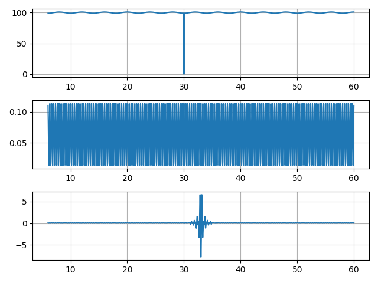
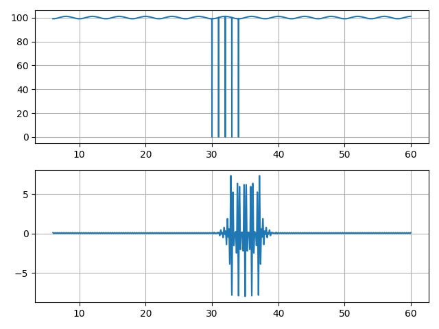
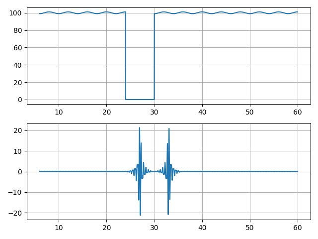

# Проблемы в "простых" данных

## Введение

Исходный код примеров - **example.py**. Синтезированные сигналы,
иллюстрирующие некоторые проблемы, встречающиеся в измерительных
сигналах.

При работе с данными "вслепую" получаем большие проблемы даже при
маленьких аномалиях.

Данные могут сопровождаться положительным признаком
достоверности. Аномалии - результат ошибок программирования,
неправильного подключения, настройки, поломок, износа и т.п.

Вспомогательный код:

```
import matplotlib.pyplot as plt
import numpy as np
import scipy.signal as sig


DT, FS = 0.02, 50
FILTER_LEN = 301


def synth():
	"""Return test signal."""
	freqs = [0.25, 3]
	amps = [1, 0.05]
	ts = np.arange(0, 60, DT)
	xs = amps[0] * np.cos(2*np.pi*freqs[0]*ts) + 50
	xs += amps[1] * np.cos(2*np.pi*freqs[1]*ts) + 50
	return xs, ts


def filt(xs, fband, ntaps=301):
	"""Filters signal."""
	h = sig.firwin(cutoff=fband, pass_zero=False, fs=FS, numtaps=ntaps)
	return sig.lfilter(h, [1], xs)


def run(func):
	"""Runs example with single figure output."""
	fig = plt.figure()
	func()
	plt.tight_layout()
	plt.savefig("{}.png".format(func.__name__))
	plt.close(fig)
```

Разберем его. Здесь

```
import matplotlib.pyplot as plt
import numpy as np
import scipy.signal as sig
```

импортируются библиотеки для рисования графиков, работы с массивами и
цифровой обработки сигналов.

Константы:

* `DT` - шаг дискретизации (через какое время брать очередное значение
  сигнала), измеряется в секундах.
* `FS` - частота дискретизации (сколько раз в секунду берется значение
  сигнала), изменяется в Герцах.
* `FILTER_LEN` - длина фильтра, которая используется во всех
  приведенных примерах, где требуется фильтрация.

**TODO** что за фильтрация, какова ее роль в наших задачах? Почему
рассматривается именно фильтрация?

Функция `synth` возвращает сигнал, представляющий собой сумму двух
гармонических составляющих с частотами 0.25 Гц и 3 Гц. Амплитуды
(размах) гармоник соответственно равны 1 и 0.05. Т.е. у
высокочастотной составляющей амплитуда намного меньше.


## Достоверный ноль

Мы иногда встречаемся с такой ситуацией. Пример про "резонанс".

Скачок и фильтрация.

```
xs, ts = synth()
xf = filt(xs, [2, 4], FILTER_LEN)
xs[len(xs) // 2] = 0
xfz = filt(xs, [2, 4], FILTER_LEN)

plt.subplot(311)
plt.plot(ts[FILTER_LEN:], xs[FILTER_LEN:])
plt.grid(True)

plt.subplot(312)
plt.plot(ts[FILTER_LEN:], xf[FILTER_LEN:])
plt.grid(True)

plt.subplot(313)
plt.plot(ts[FILTER_LEN:], xfz[FILTER_LEN:])
plt.grid(True)
```



## Повторяющиеся скачки

```
for i in range(5):
	xs[len(xs)//2 + i*50] = 0
xf = filt(xs, [2, 4], FILTER_LEN)
```




## Пропадание сигнала

```
xs, ts = synth()
xs[len(xs)//2-300:len(xs)//2] = 0
xf = filt(xs, [2, 4], FILTER_LEN)
```




## Пропуск

```
xs, ts = synth()
n = len(xs)//2
xs[n] = None
xf = filt(xs, [2, 4], FILTER_LEN)
```

Только одно значение пропущено!


Вопрос: А что, если бы использовался рекурсивный фильтр?


## Странная динамика

Температура на улице.

```
bs = [5, 15, 35, -20, -10, 18, 28, 7, 7, 13, -25]
ts = np.arange(0, 60, 1)
xs = []
for i in range(len(ts)):
	xs.append(bs[i % len(bs)])
```


## Слишком много отличий

Два датчика рядом, ожидаются похожие показания. Кто прав?

```
ts = np.arange(0, 60, 0.02)
xs1 = np.cos(2*np.pi*1*ts)
xs2 = np.cos(2*np.pi*1*ts + 0.1)
bs = np.arange(-0.3, 0.3, 0.01)
for i in range(len(xs2)):
	xs2[i] = xs2[i] + bs[i % len(bs)]
```


## Другое

* **TODO** постоянное значение (всегда одно и то же) в "адекватном"
  диапазоне.
* **TODO** неадекватные значения.
* **TODO** недостаточное описание (единицы измерения угла)
* **TODO** неучтенные особенности данных (угол в кольце)

## Задания

* Ознакомится с материалами о показателях вариации. Подумать, как
  можно использовать эти и другие показатели для выявления аномалий в
  исходных данных.
* Найти другие примеры аномалий в исходных данных, предложить подход к
  их распознаванию.

## Ссылки

* TODO: фильтрация
* [Показатели
  вариации](http://edu.tltsu.ru/sites/sites_content/site216/html/media96435/lec_5.pdf)
* [Вариация
(статистика)](https://ru.wikipedia.org/wiki/%D0%92%D0%B0%D1%80%D0%B8%D0%B0%D1%86%D0%B8%D1%8F_(%D1%81%D1%82%D0%B0%D1%82%D0%B8%D1%81%D1%82%D0%B8%D0%BA%D0%B0))
* [Coefficient of
  variation](https://en.wikipedia.org/wiki/Coefficient_of_variation)
